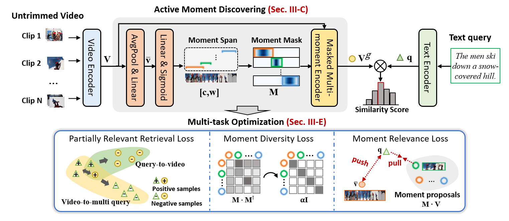

<div align="center">

# Towards Efficient Partially Relevant Video Retrieval with Active Moment Discovering

<h4 align="center">
  Peipei Song  &nbsp; 
  Long Zhang  &nbsp; 
  Long Lan  &nbsp; 
  Weidong Chen  &nbsp; 
  Dan Guo  &nbsp; 
  Xun Yang <sup>&dagger;</sup> &nbsp;
  Meng Wang  &nbsp;
</h4>

This is the repo for the official implementation of the AMDNet.
<br> 
<div>
    <a href="http://arxiv.org/abs/2504.10920"></a>
</div>


</div>

## 💡Abstract
Partially relevant video retrieval (PRVR) is a practical yet challenging task in text-to-video retrieval, where videos are untrimmed and contain much background content. The pursuit here is of both effective and efficient solutions to capture the partial correspondence between text queries and untrimmed videos. Existing PRVR methods, which typically focus on modeling multi-scale clip representations, however, suffer from content independence and information redundancy, impairing retrieval performance. To overcome these limitations, we propose a simple yet effective approach with active moment discovering (AMDNet). We are committed to discovering video moments that are semantically consistent with their queries. By using learnable span anchors to capture distinct moments and applying masked multi-moment attention to emphasize salient moments while suppressing redundant backgrounds, we achieve more compact and informative video representations. To further enhance moment modeling, we introduce a moment diversity loss to encourage different moments of distinct regions and a moment relevance loss to promote semantically query-relevant moments, which cooperate with a partially relevant retrieval loss for end-to-end optimization. Extensive experiments on two large-scale video datasets (\ie, TVR and ActivityNet Captions) demonstrate the superiority and efficiency of our AMDNet. In particular, AMDNet is about 15.5 times smaller (\#parameters) while 6.0 points higher (SumR) than the up-to-date method GMMFormer on TVR. 

## 🚀Model Architecture

Fig. 1: An overview of our proposed AMDNet.

## ☕Citation
If you find this work useful in your research, please consider citing:
```
@article{song2025towards,
  author={Song, Peipei and Zhang, Long and Lan, Long and Chen, Weidong and Guo, Dan and Yang, Xun and Wang, Meng},
  journal={IEEE Transactions on Multimedia}, 
  title={Towards Efficient Partially Relevant Video Retrieval with Active Moment Discovering}, 
  year={2025}}
```

## 🍃Acknowledgement
- This repository is based on [GMMFormer](https://github.com/gimpong/AAAI24-GMMFormer), and you may refer to it for more details about the code. 
